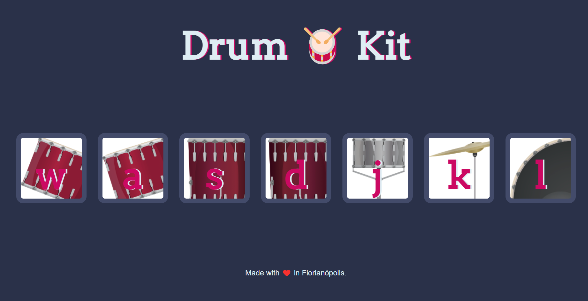

<h1>The Drum Kit 🥁</h1>

This is a Drum Kit project built using JavaScript, HTML and CSS. I've built this project during the JavaScript modules in the course <a href="https://www.udemy.com/course/the-complete-web-development-bootcamp/?src=sac&kw=the+complete+2023" target="_blank">"The Complete 2023 Web Development Bootcamp"</a>  by Angela Yu.

The Drum Kit has a set of drum parts, that can be played by either clicks or hits on keyboard (W, A, S, D, J, K and L). Every drum piece plays it's corresponding sound when the button is hit, sou you can make some music out of it!

<h2>How it looks</h2>

<h2>Languages ant tools 👩🏽‍💻</h2> 
<ul>
    <li>HTML 5;</li>
    <li>CSS 3;</li>
    <li>JavaScript.</li>
</ul>

<h2>Skills learned 💪🏽</h2>
<ul>
    <li>DOM - Document Object Model;</li>
    <li>JavaScript While Loops;</li>
    <li>JavaScript Higher Order Functions;</li>
    <li>Playing sounds with JavaScript;</li>
    <li>JavaScript switch statements.</li>
</ul>